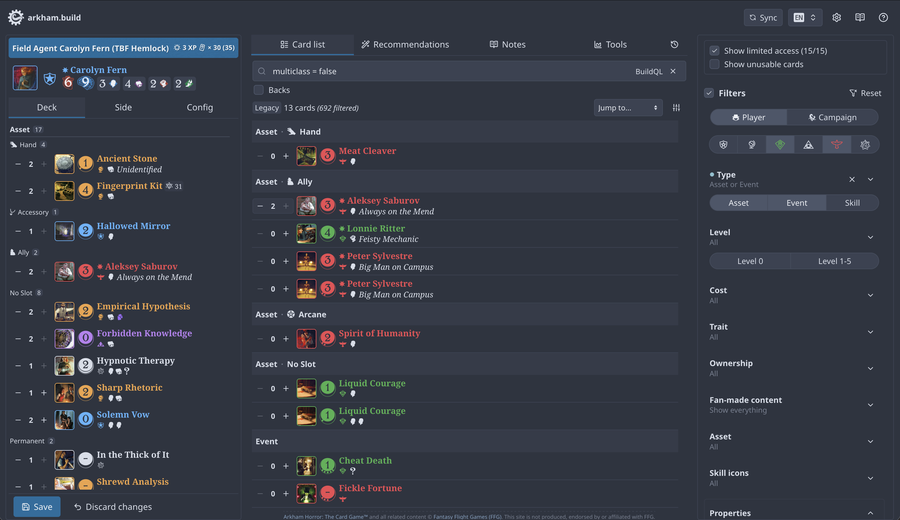

# arkham.build

> [arkham.build](https://arkham.build) is a web-based deckbuilder for Arkham Horror: The Card Game™.



## Repository structure

The Node.js 24 `npm` workspace contains:

- `frontend`: React SPA, hosted on Cloudflare Pages
- `backend`: Hono API and background worker
- `shared`: Shared Zod schemas, types, and utilities

Cloudflare Pages functions are in `functions`, end-to-end tests are in `test`, and infrastructure is in `opentofu`.

## Commands

```sh
npm install
npm run lint
npm run fmt
npm run check --workspaces
npm test --workspaces

npm run dev --workspace frontend
npm run dev --workspace backend
npm run dev:worker --workspace backend

npm run test:e2e

# Requires: git submodule update --init --recursive
npm run test:fullstack
```

See each workspace `package.json` for additional commands.

## Further reading

- [OAuth integration](./docs/oauth-integration.md)
- [Metadata](./docs/metadata.md)
- [Translations](./docs/translations.md)
