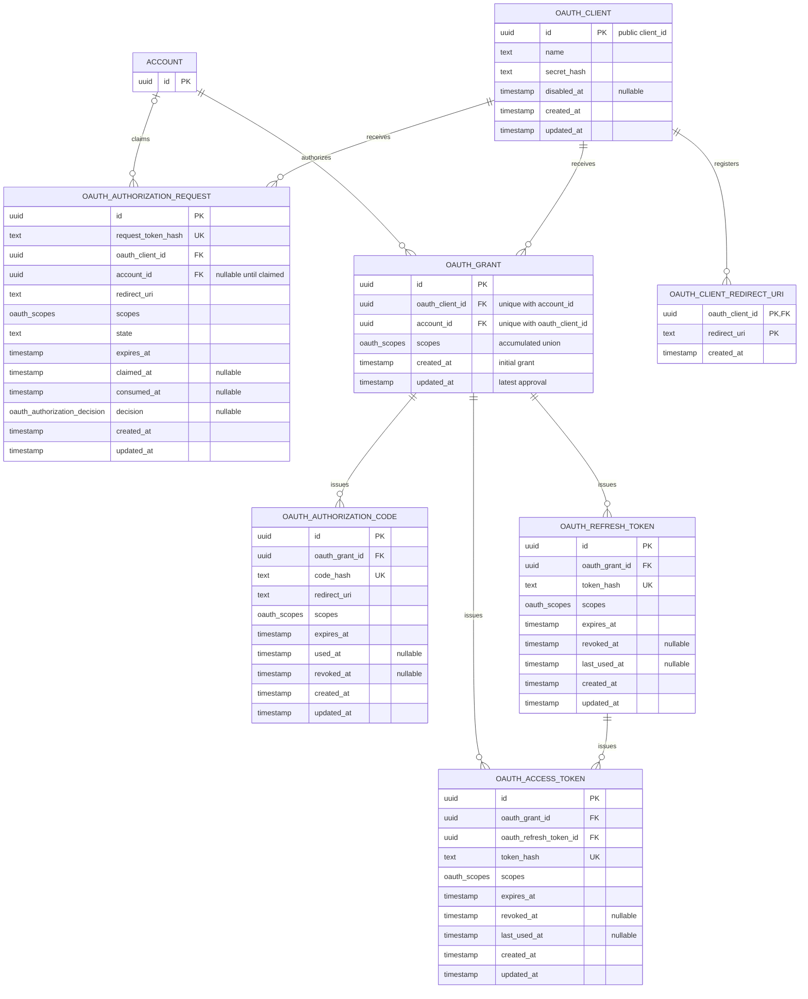

# OAuth database schema

Each authorization request belongs to exactly one client but may be unclaimed, so
its account relationship is optional. Every grant belongs to one client and one
account. Authorization codes and tokens inherit that association through their
grant. An access token must reference a refresh token belonging to the same
grant.

Redirect URIs are copied onto authorization requests and codes rather than
foreign-keyed to the registration row. This retains authorization history and
allows a removed URI's outstanding requests and codes to be invalidated without
deleting consumed records.

The `oauth_scopes` domain stores a text array so PostgreSQL clients parse it as
an array. Its check uses the `oauth_scope` enum as the centralized list of
supported values and requires `profile:read`.

The database permits zero redirect URIs during a transaction; the application
requires at least one URI per client. The existing `oauth_token` table stores
ArkhamDB identity credentials and is unrelated to these OAuth gateway tables.
